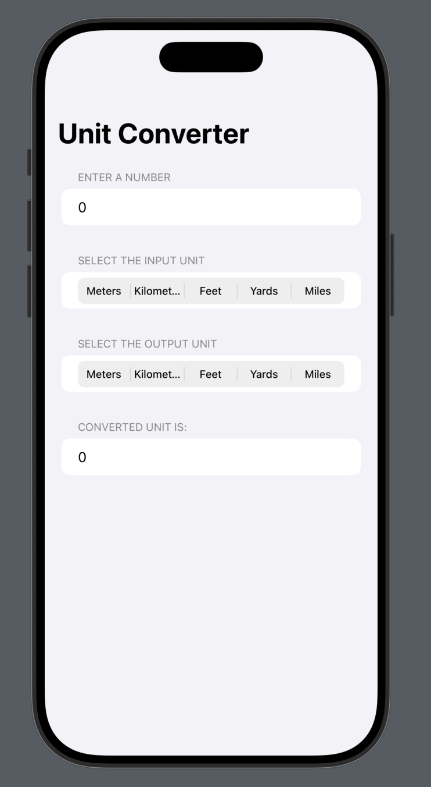

# UnitConverter 🔁

UnitConverter is a simple SwiftUI app that lets users convert values between different units such as temperature, length, time, and volume. Built during the **30 Days of SwiftUI** challenge, it demonstrates how to use `@State`, `Pickers`, and `TextFields` in SwiftUI to create reactive and dynamic interfaces.

---

## 🚀 Features

- Convert between:
  - Temperature (Celsius, Fahrenheit, Kelvin)
  - Length (meters, kilometers, feet, miles)
  - Time (seconds, minutes, hours)
  - Volume (milliliters, liters, cups, pints)
- Dynamic conversion with real-time results
- Easy-to-use interface with pickers and input fields

---

## 🖼 Screenshot

Here's how the app looks:

---

## 🛠 Built With

- **SwiftUI**
- **Xcode**
- **Swift**

---

## 📚 Learning Goals

This project helped me understand:

- SwiftUI form elements (`Picker`, `TextField`)
- Two-way data binding using `@State`
- Unit conversion logic with type-safe data handling
- Building clean and minimal UIs using SwiftUI

> Although I’m no longer actively pursuing SwiftUI, I’m proud of this project as part of my learning archive.

---

## 📁 Project Status

✅ Completed  
📦 Archived (not actively maintained)

---

## 📜 License

This project is licensed under the [MIT License](LICENSE).
